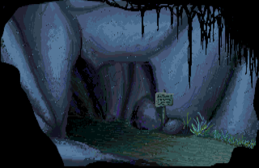
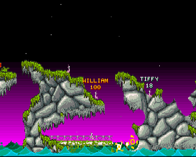
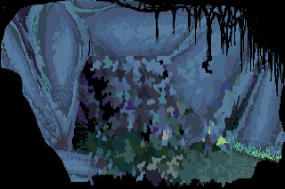

My [Blitz Basic 2](https://de.wikipedia.org/wiki/Blitz_Basic) library for the [Amiga 500](https://en.wikipedia.org/wiki/Amiga_500) and its [Motorola 68000](https://en.wikipedia.org/wiki/Motorola_68000).

It contains a small collection of miscellaneous endeavours, mostly [assembly](https://en.wikipedia.org/wiki/Assembly_language) routines bundled together with a small Blitz Basic starter. My larger Blitz Basic projects have their own repositories, see [Economacy](https://github.com/phoyh/economacy) and [China City Quiz](https://github.com/phoyh/china-city-quiz).

Some highlights are listed below.
* `Rain`: Simulates rain on an [IFF](https://en.wikipedia.org/wiki/Interchange_File_Format) background. Consists of an [Assembly](https://en.wikipedia.org/wiki/Assembly_language) routine called by a small Blitz Basic runner.
	* 
* `StarCopperMouseScroll`: [Parallax scrolling](https://en.wikipedia.org/wiki/Parallax_scrolling) of two layers based on mouse movements. One of the layers are procedurally created stars, the other is an [IFF](https://en.wikipedia.org/wiki/Interchange_File_Format) image. In addition, there is a [Copper](https://en.wikipedia.org/wiki/Amiga_Original_Chip_Set#Copper) list based color gradiant in the background.
	* 
* `Unsharp`: Iteratively applies `3x3` unsharp mask to a part of the image. Note how the image converges to some oscillation at the end.
	* 

# How to Use
Put the repository into a mounted directory of an *emulated A500* and run the start script (assuming that Blitz Basic 2 is installed in mounted `Blitz2`):
```
execute Blitz2
```

You can also start using the workbench (`info`-files provided).

The programs are pre-assembled in `bin`. You can directly execute from there, too.
